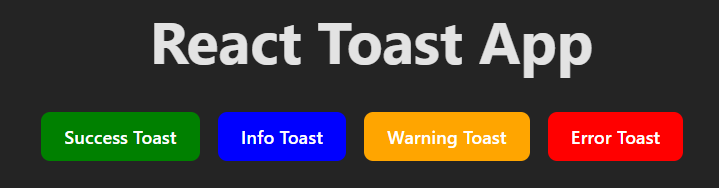
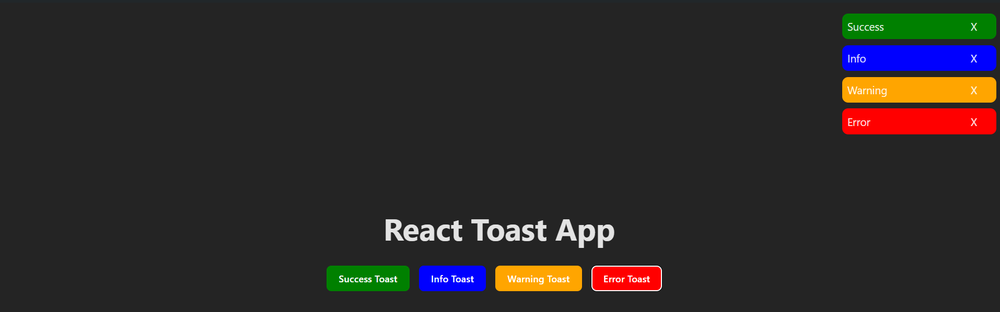
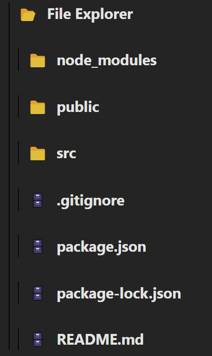
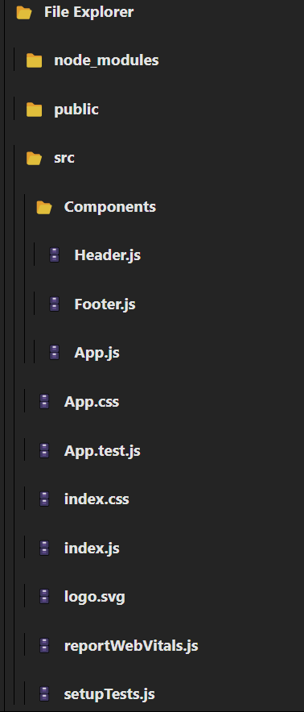
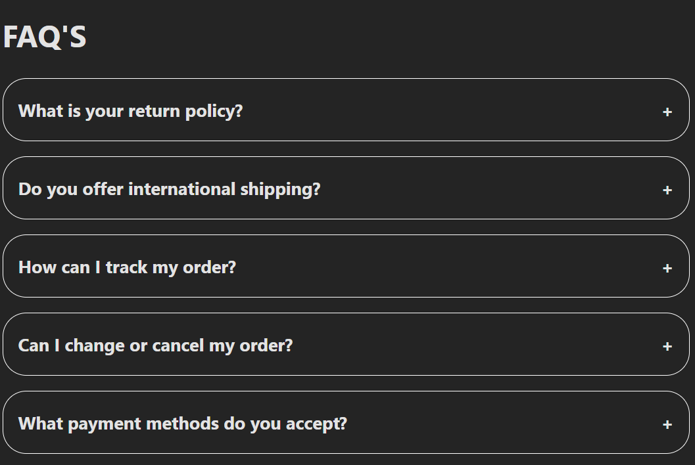
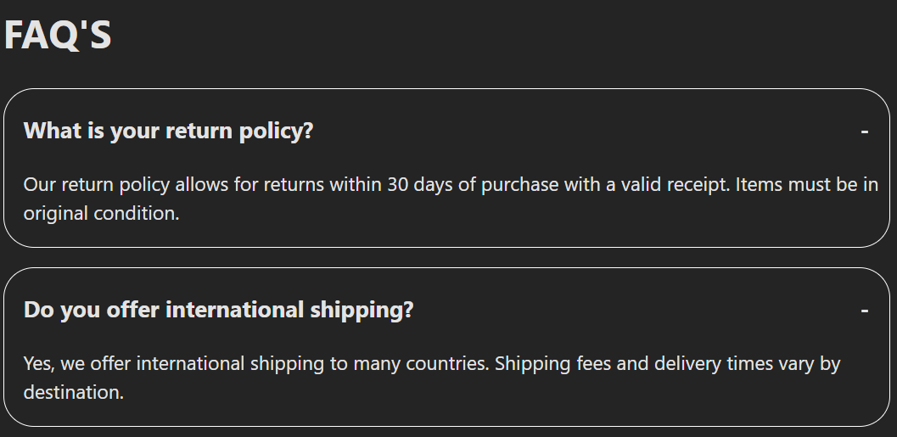

# small react question's

## 1.ReactToast

ReactToast is a small project developed as part of the RC-QUESTIONS series. This project demonstrates the implementation of toast notifications in a React application. The project features four types of buttons, each triggering a toast notification. The toasts can be manually dismissed by clicking a delete icon, and they will automatically disappear after 5 seconds.

### Features

- **Four Types of Buttons**: Each button triggers a different type of toast notification.
- **Manual Dismiss**: Toast notifications can be manually dismissed using a delete icon.
- **Automatic Dismiss**: Toast notifications automatically disappear after 5 seconds.

## Usage

### Triggering a Toast

Click any of the four buttons to trigger a toast notification. Each button corresponds to a different type of toast (e.g., success, error, warning, info).

### Dismissing a Toast

- **Manual Dismiss**: Click the delete icon on the toast to manually dismiss it.
- **Automatic Dismiss**: The toast will automatically disappear after 5 seconds.

### Project Structure

- `src/`: Contains the source code for the React application.
  - `components/`: Contains the React components.
  - `App.jsx`: The main application component.
  - `index.jsx`: The entry point of the application.

### Photos

*Description of the image*

## 2. FileExplorer

FileExplorer is a React component designed to display a file system structure with folders and files. This component allows users to click on folders to reveal their contents, displaying an icon and name for each item.

### Features

- **Folder and File Icons**: Displays appropriate icons for folders and files.
- **Toggle Children**: Click on a folder to toggle the visibility of its contents.
- **Recursive Rendering**: Renders nested folder structures recursively.

## Usage

### Displaying Folder Contents

Click on a folder name to toggle the display of its children (subfolders and files).

### Project Structure

- `src/`: Contains the source code for the React application.
  - `components/`: Contains the React components.
    - `FileExplorer.jsx`: The main component for displaying folders and files.
  - `App.jsx`: The main application component.
  - `index.jsx`: The entry point of the application.

### Photos

## 2. Accordions / Faq's

It is just normal Accordians / Faq's

### Features

- **Folder and File Icons**: Displays appropriate icons for folders and files.
- **Toggle Children**: Click on a folder to toggle the visibility of its contents.

## Usage

### Displaying Folder Contents

Click on icons to show the Faq's

### Project Structure

- `src/`: Contains the source code for the React application.
  - `components/`: Contains the React components.
    - `Accordion.jsx`: The main component for displaying folders and files.
    - `Faqs.jsx`: This file contain the logic how to show the accordians
  - `App.jsx`: The main application component.
  - `main.jsx`: The entry point of the application.

### Photos

